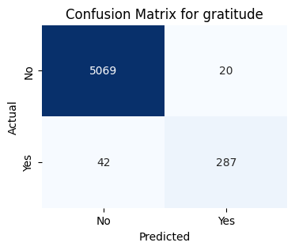
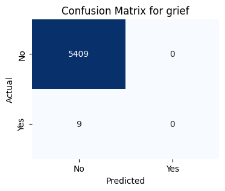
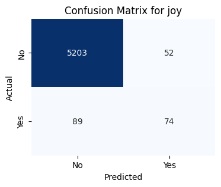
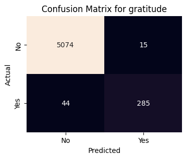
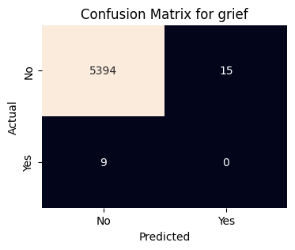

# Advanced Text Emotion Classifier

---

## Overview

The *Advanced Text Emotion Classifier* is a multi-label emotion detection system designed to predict one or more emotions present in a given piece of text. It combines a transformer-based deep learning model with explainability tools to not only classify emotions accurately but also interpret the reasoning behind each prediction. The final system is packaged into a reproducible and deployable application using FastAPI and Docker.

---

## Dataset

This project uses a cleaned version of the **GoEmotions dataset**, which contains over 54,000 Reddit comments annotated with 27 distinct emotions plus a neutral label. Each comment can have multiple emotion labels, making it a multi-label classification task. The dataset includes columns such as raw text, cleaned text, class lists, and one-hot encoded emotion vectors.

note: The model file is uploaded in google dirve downlad it : https://drive.google.com/drive/folders/1puNc0X4TrbkVSFTVO5VM1SkJWj3WxUzF?usp=drive_link and paste it on the root folder

---

## Project Workflow

1. **Data Cleaning**
   - Removed missing values
   - Lowercased and cleaned text
   - Removed stopwords
   - Converted list-like string columns into proper Python objects using `ast.literal_eval`

2. **Data Splitting**
   - Performed stratified split into training, validation, and test sets based on the number of emotion labels per instance

3. **Modeling**
   - **DistilBERT**: Fine-tuned using Hugging Face Transformers + TensorFlow
   - **LSTM**: Built from scratch using TensorFlow/Keras
   - Handled class imbalance using class weights
   - Multi-label output: sigmoid activation + binary crossentropy loss

4. **Training**
   - Used early stopping and learning rate scheduling
   - Thresholds optimized per class using precision-recall curves

5. **Evaluation**
   - Evaluated on precision, recall, and F1-score per class
   - Used **LIME** to interpret predictions on sample texts

---

## Tools & Libraries Used

- FastAPI  
- Pydantic  
- Uvicorn  
- Transformers  
- TensorFlow  
- TensorFlow Addons  
- TensorFlow Estimator  
- Keras  
- Keras Preprocessing  
- Scikit-learn  
- Pandas  
- NumPy  
- NLTK  
- LIME  
- Matplotlib  
- Seaborn  

---

## Evaluation Results

### DistilBERT Classification Report

| Emotion        | Precision | Recall | F1-score | Support |
|----------------|-----------|--------|----------|---------|
| admiration     | 0.75      | 0.58   | 0.66     | 502     |
| amusement      | 0.73      | 0.86   | 0.79     | 296     |
| anger          | 0.69      | 0.32   | 0.44     | 212     |
| annoyance      | 0.50      | 0.16   | 0.24     | 322     |
| approval       | 0.59      | 0.14   | 0.23     | 359     |
| caring         | 0.47      | 0.24   | 0.32     | 148     |
| confusion      | 0.57      | 0.23   | 0.33     | 181     |
| curiosity      | 0.43      | 0.09   | 0.15     | 264     |
| desire         | 0.52      | 0.29   | 0.37     | 77      |
| disappointment | 0.38      | 0.21   | 0.27     | 147     |
| disapproval    | 0.40      | 0.21   | 0.27     | 263     |
| disgust        | 0.63      | 0.31   | 0.42     | 102     |
| embarrassment  | 0.86      | 0.43   | 0.57     | 28      |
| excitement     | 0.50      | 0.20   | 0.28     | 101     |
| fear           | 0.54      | 0.66   | 0.60     | 74      |
| gratitude      | 0.93      | 0.87   | 0.90     | 329     |
| grief          | 0.00      | 0.00   | 0.00     | 9       |
| joy            | 0.59      | 0.45   | 0.51     | 163     |
| love           | 0.72      | 0.81   | 0.76     | 257     |
| nervousness    | 0.26      | 0.26   | 0.26     | 23      |
| optimism       | 0.70      | 0.33   | 0.45     | 197     |
| pride          | 1.00      | 0.44   | 0.61     | 16      |
| **macro avg**  | **0.55**  | **0.38**| **0.43** | 6371    |
| **samples avg**| **0.55**  | **0.53**| **0.53** | 6371    |

**→ Summary**: DistilBERT achieved higher precision across most emotion classes, especially for "admiration", "gratitude", and "love", showing strong generalization and balance. Its ability to learn nuanced language context makes it the better model overall.

---

### LSTM Classification Report

| Emotion        | Precision | Recall | F1-score | Support |
|----------------|-----------|--------|----------|---------|
| admiration     | 0.64      | 0.61   | 0.63     | 502     |
| amusement      | 0.73      | 0.79   | 0.76     | 296     |
| anger          | 0.39      | 0.54   | 0.45     | 212     |
| annoyance      | 0.27      | 0.45   | 0.34     | 322     |
| approval       | 0.28      | 0.33   | 0.30     | 359     |
| caring         | 0.26      | 0.39   | 0.31     | 148     |
| confusion      | 0.22      | 0.24   | 0.23     | 181     |
| curiosity      | 0.16      | 0.34   | 0.22     | 264     |
| desire         | 0.38      | 0.39   | 0.38     | 77      |
| disappointment | 0.14      | 0.33   | 0.20     | 147     |
| disapproval    | 0.24      | 0.41   | 0.30     | 263     |
| disgust        | 0.52      | 0.45   | 0.48     | 102     |
| embarrassment  | 1.00      | 0.21   | 0.35     | 28      |
| excitement     | 0.30      | 0.25   | 0.27     | 101     |
| fear           | 0.51      | 0.62   | 0.56     | 74      |
| gratitude      | 0.95      | 0.87   | 0.91     | 329     |
| grief          | 0.00      | 0.00   | 0.00     | 9       |
| joy            | 0.60      | 0.50   | 0.55     | 163     |
| love           | 0.68      | 0.85   | 0.76     | 257     |
| nervousness    | 0.24      | 0.35   | 0.29     | 23      |
| optimism       | 0.57      | 0.49   | 0.53     | 197     |
| pride          | 0.56      | 0.31   | 0.40     | 16      |
| **macro avg**  | **0.43**  | **0.46**| **0.42** | 6371    |
| **samples avg**| **0.50**  | **0.62**| **0.53** | 6371    |

**→ Summary**: The LSTM model performed reasonably well but underperformed compared to DistilBERT in many classes, especially in lower-frequency emotions. It showed slightly better recall but overall less precision and weaker interpretability.

### Confusion Matrices

We generated 28 confusion matrices per model to assess class-level performance. Below are some example confusion matrices from the models:

#### DistilBERT Samples

  
  


#### LSTM Samples

  
  


> [Click here to view all confusion matrices for DistilBERT](./confusion_matrices/distilbert/)  
> [Click here to view all confusion matrices for LSTM](./confusion_matrices/lstm/)

---

## Conclusion

While both models are capable of detecting emotional content in text, **DistilBERT outperforms LSTM** in terms of overall F1-score, precision, and per-class robustness. Its transformer-based architecture allows it to capture richer semantic patterns, making it the preferred choice for this multi-label emotion classification task.

---

## Using the Docker Image

The Emotion Classifier API is also available as a Docker image on Docker Hub for easy deployment and testing.

To run the API locally using Docker, follow these steps:

1. **Pull the Docker image:**

```bash
docker pull rizan0120/emotion-api:
```

2. **Run the container:**

```bash
docker pull rizan0120/emotion-api:latest
```
This will start the API server on port 8000

2. **Access the API:**

Open your browser or API client (e.g., Postman) and send requests to:

http://localhost:8000

---
